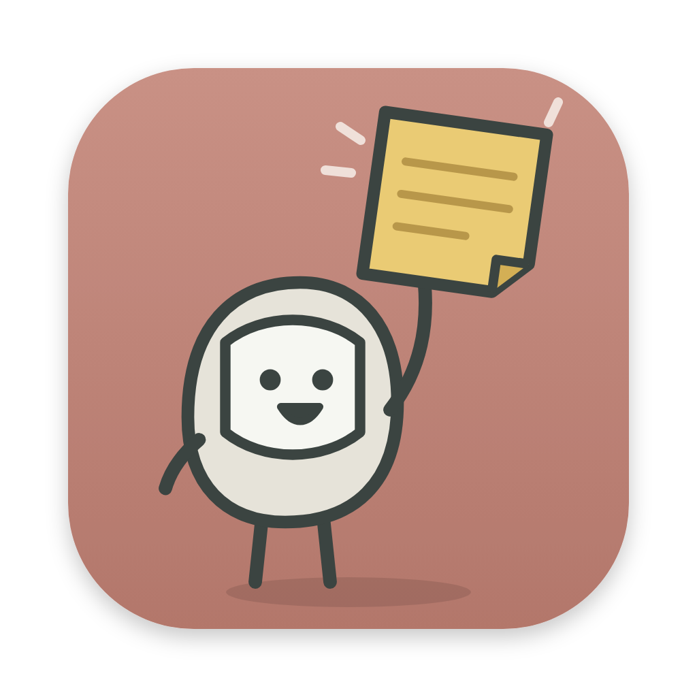
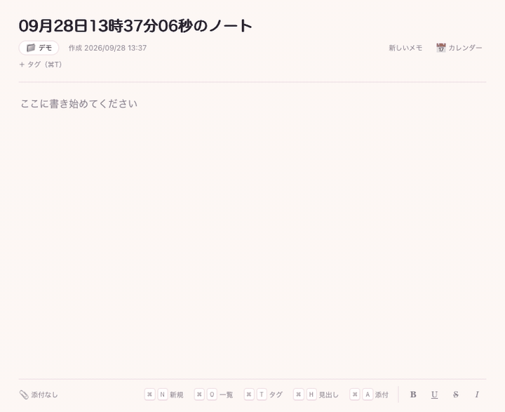

# PopNote!



PopNote! は、押したらポンッと出てきてすぐに書ける macOS 用のクイックメモです。会議中などに思いついたことを、ランチャーからワンアクションで書き留められます。

書いたメモは自動で保存され、タグ・一覧・カレンダーからあとで見返せます。PopNote! だけでも使えますし、[Tomelet](https://github.com/kobito-tools/Tomelet) の基準パスを保存先にすると、メモが Tomelet のカレンダーや横断検索にも並びます。[OpenSesame!](https://github.com/kobito-tools/OpenSesame) に登録すると、キーを押すだけで開けます。



## 動作環境

- macOS 13 以降（Apple Silicon / Intel）
- Tomelet は任意です（連携する場合は `Tomelet.app` を一度起動しておきます）

## ダウンロード

[Releases](../../releases/latest) ページから `PopNote!_x.y.z_universal.zip` をダウンロードしてください。`x.y.z` にはバージョン番号が入ります。

## インストール

1. ダウンロードした `.zip` ファイルを開き、展開された `PopNote!.app` を Applications フォルダにドラッグします。
2. アプリケーションフォルダから PopNote! を起動します。

本アプリは Apple の公証を受けていないため、初回起動時に「開発元を確認できません」などの警告が表示されます。その場合は警告を閉じ、「システム設定」→「プライバシーとセキュリティ」を開いて、画面下部の「このまま開く」をクリックしてください。2 回目以降は通常どおり起動できます。

「壊れているため開けません」と表示される場合は、ターミナルで次のコマンドを実行してから、再度起動してください。

```bash
xattr -dr com.apple.quarantine "/Applications/PopNote!.app"
```

ソースから作る場合は、このリポジトリをクローンして `PopNote-Setup.command` を実行します（Xcode Command Line Tools が必要です。詳しくは [docs/DEVELOPMENT.md](docs/DEVELOPMENT.md)）。

## 保存先

初めて起動すると、メモの保存先を選ぶ画面が出ます。画面左上の「📁」からいつでも切り替えられます。

| 選んだフォルダ | 動作 |
|---|---|
| Tomelet の基準パス | Tomelet と同じID・同じタグで、`.kobito-tools/PopNote/` に保存します。Tomelet で「本アプリでも表示する」を選ぶと、Tomelet のカレンダー・検索にも表示されます |
| それ以外のフォルダ | ID（保存先の名前）を付けて、フォルダ直下に `.kobito-tools/` を作ります。PopNote! だけで読み書きできます |

- メモは常に PopNote! が `.kobito-tools/PopNote/` へ直接保存します。Tomelet のデータ（`.kobito-tools/Tomelet/`）には書き込みません。
- タグは `.kobito-tools/Tags/` で Tomelet と共有します。どちらで作ったタグも両方で使えます。
- 後からそのフォルダを Tomelet の基準パスにすると、Tomelet が PopNote! のデータを見つけて、表示するかを尋ねます。
- 以前の版の `.TickTockTome/` があるフォルダは、Tomelet で一度開くと新しい形式へ移行されます（PopNote! だけでは移行しません）。
- 保存先を選ぶ前に書き始めても大丈夫です。選んだ時点で、その保存先へ保存します。
- 使ったことのある保存先は一覧に残ります。一覧から外しても、フォルダのデータは消えません。

## 使い方

起動すると、すぐに新しいメモが開きます。入力は自動で保存されるので、保存操作はいりません。

| 操作 | 内容 |
|---|---|
| `⌘N` | 新しいメモ。作成日時は押した時刻、見出しの初期値は「09月23日14時05分07秒のノート」 |
| `⌘O` | 過去のメモ一覧。見出し・本文・タグで絞り込み、`↑↓` と `Enter` で開く |
| `⌘T` | タグ設定モード。一致するタグを候補表示し、候補を選んで `Enter` で追加、候補を選ばずに `Enter` で「その他」に新しいタグを作成 |
| `⌘H` | 見出し編集モード |
| `⌘A` | ファイル添付。保存先フォルダの中のファイルを選び、保存先からの相対パスだけを記録。`⌘V` でクリップボードの画像も添付 |
| `⌘B`・`⌘U`・`⌘X`・`⌘I` | ボールド・下線・取り消し線・イタリック |
| `⌘Q` | PopNote! を閉じる（保存待ちの内容を書き込んでから閉じます） |
| 📅 カレンダー | 作成日ごとにメモを月のカレンダーで表示。日を選ぶとその日のメモ一覧、`←→↑↓` で日を移動、`PageUp`・`PageDown` で前月・翌月 |

- `⌘O` の一覧は「更新が新しい順・作成が新しい順・作成が古い順・見出し順・タグ別にまとめる」で並べ替えられます。タグを押すと、そのタグを持つメモだけに絞り込めます（複数選ぶと、すべてを持つメモ）。
- モードは、同じショートカットをもう一度押すか `Esc` で閉じます。
- 本文に貼り付けた画像は、本文中に表示され、添付にも加わります。
- `⌘X` と `⌘A` は装飾と添付に使うため、カットと全選択は「編集」メニューから選びます。
- 「ウインドウ」メニューの「常に手前に表示」で、ほかのアプリより前面に固定できます。

### ランチャーから開く

OpenSesame! などのランチャーには `PopNote!.app` を登録します。URL にも対応しています。

| URL | 動作 |
|---|---|
| `popnote://new` | 新しいメモを開く |
| `popnote://open/<メモID>?dataset=<データセットキー>` | 指定したメモを開く（保存先が違えば切り替えてから開く） |

すでに起動している場合は、同じウィンドウで切り替えます。

## Tomelet との連携

- 保存先が Tomelet の基準パスなら、メモは作成日時の日付で Tomelet のカレンダーに表示され、横断検索、ファイル一覧の関連作業、活動分析の元データにも加わります。
- Tomelet 画面上部の「✎」やカレンダーのメモから、PopNote! の該当メモを開けます。
- 削除したメモは、その保存先を Tomelet で開くと、設定画面のゴミ箱から復元できます。

## トラブルシューティング

### 「このメモの保存先が見つかりません」と表示される

Tomelet のカレンダーから開いたメモの保存先が、PopNote! の保存先の一覧にありません。画面左上の「📁」から、Tomelet で開いている基準パスを保存先に選んでから、もう一度開いてください。

### 「保存できません：この保存先は「<Mac の名前>」で使用中です。」と表示される

保存先を別の Mac の PopNote! または Tomelet が開いています。書きかけの内容は画面に残り、PopNote! が数秒ごとに保存し直します。そちらを終了し、同期が終わるまで PopNote! を閉じずにお待ちください。

## アンインストール

1. PopNote! を終了し、アプリケーションフォルダの `PopNote!.app` をゴミ箱へ移動します。
2. Tomelet との連携の許可も取り消す場合は、Tomelet の `config/integrations.json`（`~/Library/Application Support/TickTockTome/config/`）から `"id": "popnote"` の項目を削除します。

書いたメモは保存先フォルダの `.kobito-tools/PopNote/` に残ります。

## プライバシー

PopNote! は外部と通信しません。通信先は同じ Mac の Tomelet（`127.0.0.1`）だけです。メモ本文や貼り付けた画像は、選んだ保存先の `.kobito-tools/PopNote/` にあります。PopNote! 自体は、使った保存先の一覧、ウィンドウ位置、「常に手前に表示」の設定だけを保存します。

## ライセンス

本ソフトウェアは [MIT License](LICENSE) のもとで提供されています。

本ソフトウェアは現状のまま提供され、いかなる保証もありません。本ソフトウェアの使用によって生じたいかなる損害についても、作者は責任を負いません。詳細は [LICENSE](LICENSE) を参照してください。

## 開発について

本ソフトウェアの開発には、ChatGPT（OpenAI）および Claude（Anthropic）を使用しています。本プロジェクトは個人によるものであり、OpenAI および Anthropic とは関係ありません。

ビルド方法、ソースコードの構成、Tomelet との連携の仕組みについては [docs/DEVELOPMENT.md](docs/DEVELOPMENT.md) を参照してください。不具合の報告や要望は [Issues](../../issues) で受け付けています。
